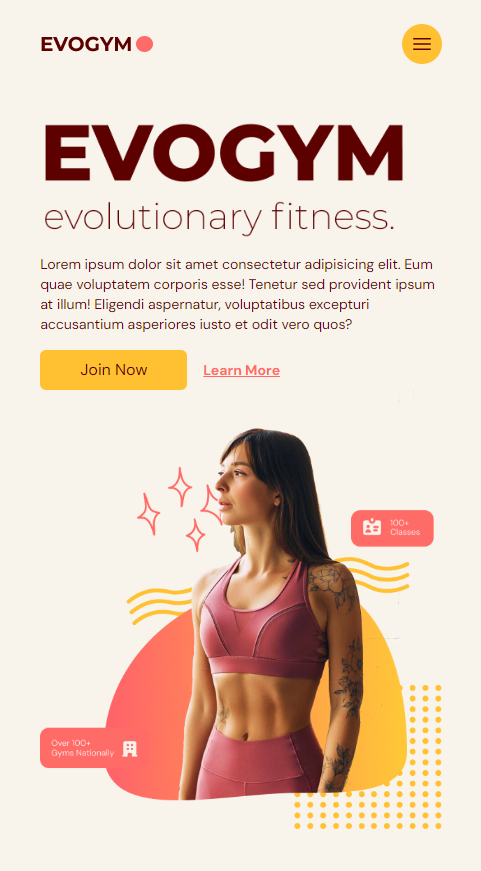
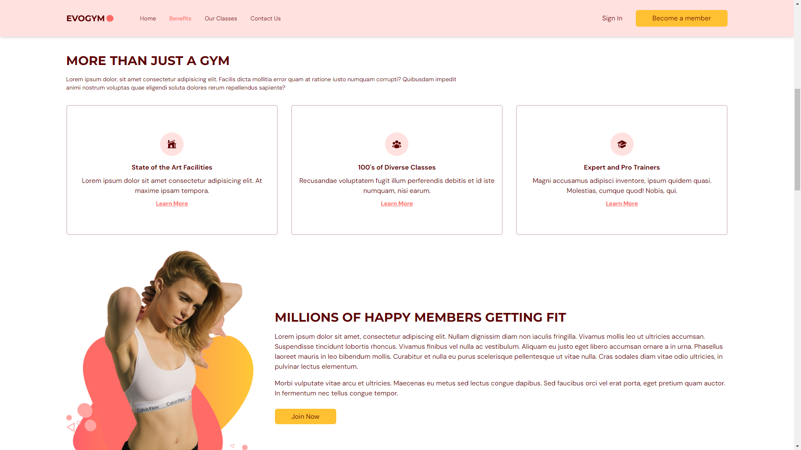
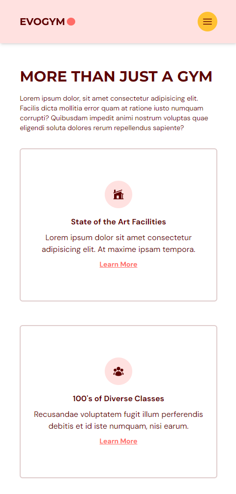
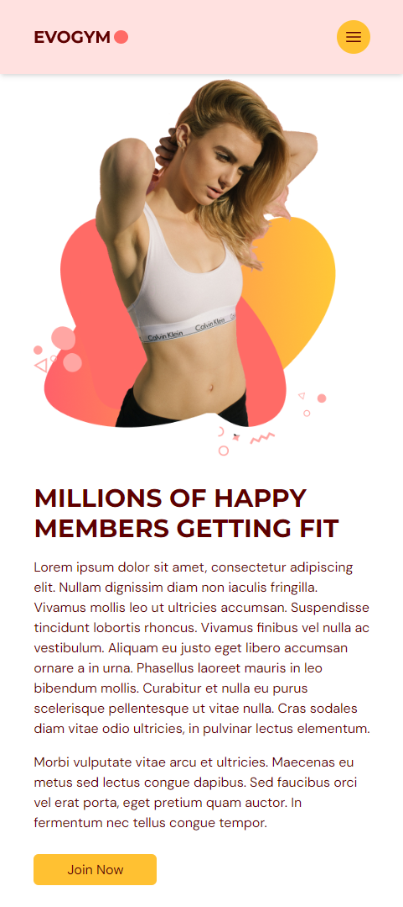
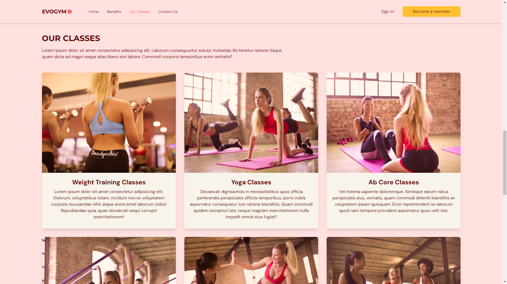
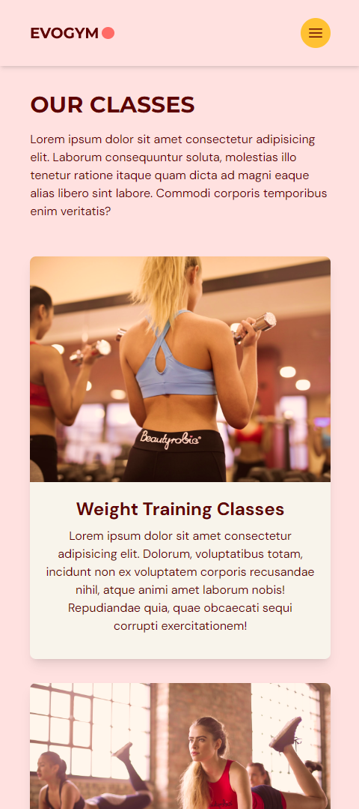
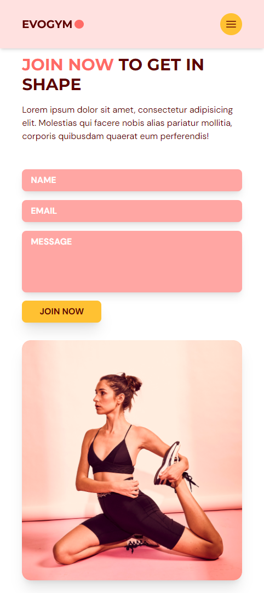
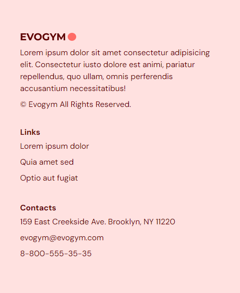
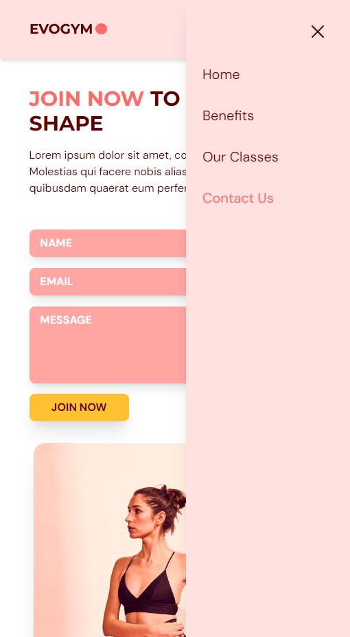

# EVOGYM

Gym landing page using React, TypeScript and Tailwind CSS.

The npm package [react-anchor-link-smooth-scroll](https://www.npmjs.com/package/react-anchor-link-smooth-scroll) was used for smooth scrolling to sections. For animations: [framer-motion](https://www.npmjs.com/package/framer-motion).

## Demonstration

### "Home" section

### "Benefits" section

### "Our Classes" section

### "Contact us" section and footer

### Side navbar

---

Inspired by https://github.com/ed-roh/gym-typescript
